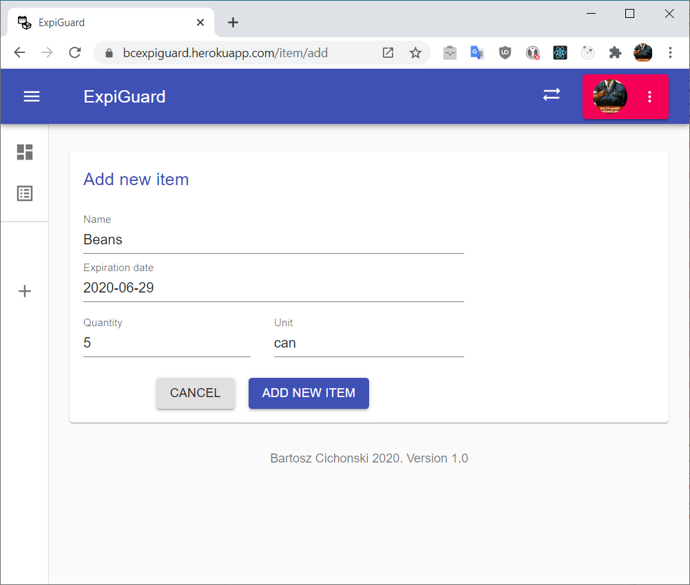

# BcExpiGuard

> Keep things from getting expired, learn React and stuff at the same time

> react, redux, PWA, nodejs, pouchdb 

***Screenshots***

---

### Clone

- Clone this repo to your local machine using `https://github.com/bcichonski/BcExpiGuard.git`

### Available Scripts

In the project directory, you can run:

#### `npm start`

Runs the app in the development mode. 
Open [http://localhost:3000](http://localhost:3000) to view it in the browser.

The page will reload if you make edits. 
You will also see any lint errors in the console.

#### `npm run build`

Builds the app for production to the `build` folder. 
It correctly bundles React in production mode and optimizes the build for the best performance.

The build is minified and the filenames include the hashes. 
Your app is ready to be deployed!

See the section about [deployment](https://facebook.github.io/create-react-app/docs/deployment) for more information.

---

## Technologies

* This project was bootstrapped with [Create React App](https://github.com/facebook/create-react-app).
* It utilizes [React](https://reactjs.org/), [Redux](https://redux.js.org) & [bunch of additions](/package.json) for core dev
* [MATERIAL-UI](https://material-ui.com) for the UI
* [PouchDb](https://pouchdb.com) / [CouchDb](https://couchdb.apache.org/) for storing data
* [Auth0](https://auth0.com) integration for handling auth-related stuff
* Hosting provided by [Heroku](https://www.heroku.com/)

---

## Team

> Me, Myself & I 

---

## Contact

My old fashioned email is displayed in my github profile page.

## License

- **[MIT license](http://opensource.org/licenses/mit-license.php)**