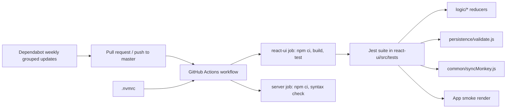
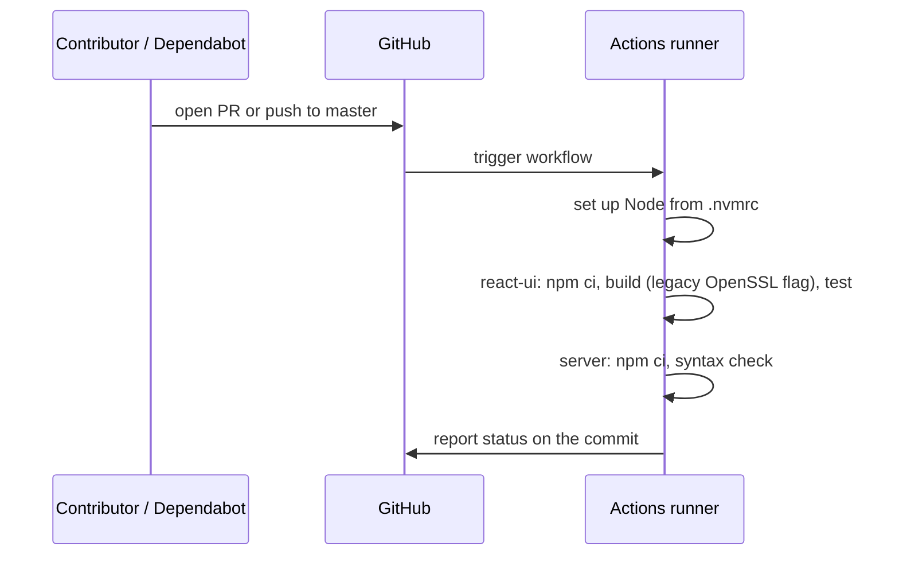

# Modernization Phase 0: Baseline and Safety Net (CI + Tests) Plan

**Plan Status**: `FINAL`

**Story Type**: `Internal`

> This plan captures **what** to build and **why** — domain, architecture, decisions, and verified facts.
> It deliberately does **not** contain implementation code, pseudocode, line numbers, mock setups, or test bodies.
> The implementation agent discovers the **how** against live code. See §4 Task Breakdown.

Source: GitHub issue [#25](https://github.com/bcichonski/BcExpiGuard/issues/25) — first phase of the modernization plan (issues #21–#31).

---

## 1. Problem Statement

*   **Context**: The project is a 2020 Create React App 3.4.1 (`react-ui/`) plus a static Express host (`server/`), declared for Node 12. There is no CI, Dependabot PRs pile up unverified, and the only test (`react-ui/src/tests/App.test.js`) is the CRA placeholder, which fails because it renders `<App />` without a Redux `Provider`. The CouchDB server configuration the app depends on is not recorded anywhere in the repo.
*   **Goal**: Put a safety net in place — a pinned runtime, real tests for the pure logic, a CI workflow that builds and tests every PR and `master`, quieter Dependabot, and the CouchDB contract written down — so later modernization phases have something to check against.
*   **In scope**: issue tasks 0.2–0.7.
*   **Out of scope**:
    *   Task 0.1 (merge Dependabot #13 and #15) — **already done**; both are merged on `master` (merge commits `d6fad98`, `2f69da7`). Nothing to implement.
    *   Any production-code change. Phase 0 adds tests, config and docs only. Defects #21–#24 and quirks found while writing tests are pinned as-is, not fixed.
    *   Toolchain upgrades (CRA → Vite, Jest → Vitest) — Phase 1 (#26).

### 1.1 Technical Summary

*   **Touched projects**: `react-ui` (tests, `package.json` engines), repo root (`.nvmrc`, `package.json` engines, `README.md`, `.github/`), `doc/couchdb/` (new docs).
*   **New patterns / abstractions**: none in production code. Tests use the already-installed CRA Jest 24 + Testing Library stack.
*   **Infrastructure changes**: new GitHub Actions workflow; new Dependabot config. No runtime infrastructure.
*   **End-state observable behavior**: `npm test` in `react-ui` is green and covers persistence helpers, reducers and the sync backoff; every PR and every push to `master` gets a CI run that installs, builds and tests; Dependabot opens grouped weekly PRs.

---

## 2. Architecture & Design

### 2.1 Architecture Overview

#### Involved services & owners

| Service | Technical Owner |
| :--- | :--- |
| `react-ui` (CRA frontend) | repo owner (@bcichonski) |
| `server` (Express static host) | repo owner (@bcichonski) |
| GitHub Actions / Dependabot config | repo owner (@bcichonski) |

#### C2 diagram

#### Flow diagram

### 2.2 External Contracts & Evidence

N/A — Internal story.

### 2.3 Affected Areas

| Area / File (pointer) | Role in this change | Likely action |
| :--- | :--- | :--- |
| `.nvmrc` | Single source of the target Node version for developers and CI. | New |
| `package.json`, `react-ui/package.json` | `engines` declaration (root currently says `12.x`; `react-ui` has none). | Change |
| `README.md` | Developer instructions; must document the Node version and the temporary OpenSSL workaround. | Change |
| `react-ui/src/tests/App.test.js` | Failing CRA placeholder test. | Change (replace) |
| `react-ui/src/tests/setupTests.js` | jest-dom matcher setup. CRA only auto-loads `src/setupTests.js`, so this file is currently **not** loaded. | Reference / Change |
| `react-ui/src/App.js`, `react-ui/src/common/auth0.js`, `react-ui/src/common/store.js` | What the smoke test has to wrap: `connect`ed `App`, the exported `Auth0Context`, the Redux store. | Reference |
| `react-ui/src/persistence/validate.js` | Pure helpers: `ensureDb`, `toPouch_id`, `fromPouch_id`, `transfromFromPouch`. | Reference (tested) |
| `react-ui/src/logic/*/reducers.js` (appstate, categories, item-edit-add, item-list, item-names) | Reducers under test. | Reference (tested) |
| `react-ui/src/common/utils.js` | `refresh` / `refreshState` used by the reducers; exercised through them. | Reference |
| `react-ui/src/common/syncMonkey.js` | Singleton with the backoff logic; imports `persistence`. | Reference (tested) |
| `.github/workflows/` | CI workflow. | New |
| `.github/dependabot.yml` | Grouped update config. | New |
| `react-ui/src/persistence/DbProvider.js`, `react-ui/src/constants/constants.js`, `react-ui/src/constants/auth_config.json` | The client side of the CouchDB contract: DB names, filter name and params, remote URL, JWT audience. | Reference |
| `doc/couchdb/` | Where the CouchDB setup is captured. | New |

### 2.4 Key Algorithms & Behaviour

*   **Tests are characterization tests.** They assert what the code does today. Where current behaviour looks wrong, the test pins it and a comment names the oddity; it is not fixed here. Known example: in `syncMonkey.backoff` the growth-ratio branch for "above half the max timeout" can never be reached because the "above a quarter" branch is tested first.
*   **Sync backoff, as it behaves today** (what the tests must cover): the timeout starts at the minimum (1 s); each backoff multiplies it by a ratio and adds a random salt; it is capped at the maximum (5 min); a non-numeric or below-minimum timeout resets to the minimum; `reset` during a running sync is deferred until the sync ends. Randomness and timers must be made deterministic in tests.
*   **Smoke test isolation**: the test renders the unauthenticated, not-loading state so that no login, no PouchDB remote and no network call is triggered. It must not start real timers that outlive the test.
*   **CI build flag**: `react-scripts` 3.4.1 (webpack 4) needs `NODE_OPTIONS=--openssl-legacy-provider` to build on current Node. Verified locally on Node 24.21: build succeeds with the flag; the Jest run does not need it.

---

## 3. Key Decisions & Assumptions

*   **Decision — target Node is 24.** The issue allows "22 or 24". Node 24 is the current active LTS and the existing toolchain was verified to build (with the flag) and run Jest on 24.21, so there is no reason to pick the older line.
*   **Decision — `engines` is a floor, not an exact pin**: `>=24` in both `package.json` files; `.nvmrc` holds `24`. An exact pin would make every Node patch release a breaking change for contributors.
*   **Decision — the OpenSSL workaround lives in CI env and the README, not in npm scripts.** Putting `NODE_OPTIONS=…` inline in a script is not portable to Windows shells without adding a dependency, and Phase 1 removes the need entirely.
*   **Decision — keep CRA's Jest 24 and the installed Testing Library versions.** No test-tooling upgrade; Phase 1 moves to Vitest.
*   **Decision — tests stay under `react-ui/src/tests/`**, mirroring the source folders, next to the existing test.
*   **Decision — no production code changes.** If something is untestable without a refactor, test what is reachable and note the gap.
*   **Decision — the server CI job is install + syntax check only.** `server/index.js` starts listening on import and has no tests or exports; adding a test harness means refactoring a file Phase 5 may delete. `npm ci` plus `node --check` still catches a broken lockfile or syntax error.
*   **Decision — Dependabot**: weekly; npm ecosystem for `/` and `/react-ui`, plus `github-actions`; minor and patch updates grouped into one PR per directory; majors stay individual. Security updates are unaffected by grouping of version updates.
*   **Decision — CI triggers**: `pull_request` (any branch) and `push` to `master`.
*   **Assumption — CouchDB server-side settings cannot be read from here.** The live server (`expiguard.bartq.toh.info`) is not reachable from the implementation environment and the `restrict/restrict` design doc is not in the repo. T8 therefore documents (a) everything the client code proves — DB names, filter name, the query parameters each DB is replicated with, the JWT bearer header and audience, the origin CORS must allow — and (b) a **reference** design doc and server settings reconstructed from those client requirements, explicitly labelled *unverified, to be replaced with an export from the live server*, with the exact commands the owner runs to export the real values. This does not affect the correctness of any code, so it is not an Open Question; the residual gap is flagged in the document itself and in the PR.
*   **Assumption — "CI green on `master`"** can only be observed after merge. The PR's own CI run is the proxy within this story.

### 3.1 Decision Lock (Constants & Policies)

| Constant / Policy | Selected Value | Why | Where it lives |
| :--- | :--- | :--- | :--- |
| Node version | `24` | Current LTS, verified locally | `.nvmrc` |
| `engines.node` | `>=24` | Floor, not exact pin | `package.json`, `react-ui/package.json` |
| Build workaround | `NODE_OPTIONS=--openssl-legacy-provider` | Required by webpack 4 on Node ≥17 | CI env for the build step; README |
| CI triggers | `pull_request`; `push` to `master` | Issue AC | workflow file |
| Dependabot cadence | weekly, minor+patch grouped | Issue AC | `.github/dependabot.yml` |
| Test style | characterization, no production changes | Phase 0 is a safety net | all test tasks |

### 3.2 Open Questions

No open questions.

---

## 4. Task Breakdown

| Task | Title | Depends on | Complexity |
| :--- | :--- | :--- | :--- |
| `T1` | Pin Node version and document the build workaround | — | `Low` |
| `T2` | Replace placeholder test with an App smoke test | — | `Medium` |
| `T3` | Unit tests for persistence validation helpers | — | `Low` |
| `T4` | Unit tests for the `logic/*` reducers | — | `Medium` |
| `T5` | Unit tests for the syncMonkey backoff | — | `Medium` |
| `T6` | GitHub Actions CI workflow | `T1` | `Low` |
| `T7` | Dependabot grouped-updates config | — | `Low` |
| `T8` | Capture the CouchDB setup in `doc/couchdb/` | — | `Medium` |

### T1 — Pin Node version and document the build workaround

*   **Goal**: Developers and CI agree on Node 24, and the README explains how to build today.
*   **Depends on**: `—`
*   **Complexity**: `Low`
*   **Pointers**: `.nvmrc` (new), `package.json`, `react-ui/package.json`, `README.md`.
*   **Definition of Done**: `.nvmrc` contains `24`; both `package.json` files declare `engines.node` `>=24` (root no longer says `12.x`); README has a short prerequisites section naming the Node version and `.nvmrc`, and documents that `npm run build` currently needs `NODE_OPTIONS=--openssl-legacy-provider`, marked as temporary until Phase 1 (#26); README script names are correct (it currently says `npm build`). Lockfiles are not regenerated.
*   **Tests expected**: none (config/docs). Confirm `npm run build` in `react-ui` still succeeds with the flag.

### T2 — Replace placeholder test with an App smoke test

*   **Goal**: A passing test that proves `<App />` mounts inside a Redux `Provider` and a mocked Auth0 context.
*   **Depends on**: `—`
*   **Complexity**: `Medium`
*   **Pointers**: `react-ui/src/tests/App.test.js`, `react-ui/src/tests/setupTests.js`, `react-ui/src/App.js`, `react-ui/src/common/auth0.js` (exports `Auth0Context`), `react-ui/src/common/store.js`, `react-ui/src/index.js` (how the real tree is composed).
*   **Definition of Done**: the placeholder assertion is gone; the test renders `App` wrapped in `Provider` and a mocked Auth0 context value for an unauthenticated, not-loading user and asserts something a user would see; a second case covers the loading state showing the loading panel; no network access, no real Auth0 client, no timers left running; jest-dom matchers work (make the setup file actually load, without ejecting — moving it to where CRA looks for it is acceptable); `CI=true npm test` in `react-ui` passes.
*   **Tests expected**: component (Testing Library) — unauthenticated render; loading render.

### T3 — Unit tests for persistence validation helpers

*   **Goal**: `persistence/validate.js` is covered.
*   **Depends on**: `—`
*   **Complexity**: `Low`
*   **Pointers**: `react-ui/src/persistence/validate.js`; new test file under `react-ui/src/tests/persistence/`.
*   **Definition of Done**: every exported function has tests for its success path and each error it throws; tests import the module directly without pulling in PouchDB; suite passes.
*   **Tests expected**: unit — `ensureDb` (missing provider, remote without login, missing `local`, unregistered DB, valid); `toPouch_id` (id moved to `_id`, input not mutated, missing payload, missing id); `fromPouch_id` (`_id` moved to `id`, already-converted payload passes through, missing payload, no id at all); `transfromFromPouch` (rows with `doc`, single document, design docs filtered out).

### T4 — Unit tests for the `logic/*` reducers

*   **Goal**: Every reducer in `logic/*` has tests for each action type it handles.
*   **Depends on**: `—`
*   **Complexity**: `Medium`
*   **Pointers**: `react-ui/src/logic/{appstate,categories,item-edit-add,item-list,item-names}/reducers.js` and their `types.js`; `react-ui/src/common/utils.js`; new test files under `react-ui/src/tests/logic/`.
*   **Definition of Done**: one test file per reducer; each covers the initial state, every handled action type, and the unknown-action passthrough; reducers are imported from their `reducers.js` so the persistence layer is not loaded (if a reducer's import chain makes that impossible, mock the persistence module); the item-list refresh case covers "newer wins / older ignored" by `changed_timestamp`; observed state mutation or other oddities are pinned and commented, not fixed; suite passes.
*   **Tests expected**: unit — per reducer as above.

### T5 — Unit tests for the syncMonkey backoff

*   **Goal**: The backoff/reset behaviour of `common/syncMonkey.js` is pinned by tests.
*   **Depends on**: `—`
*   **Complexity**: `Medium`
*   **Pointers**: `react-ui/src/common/syncMonkey.js`; `react-ui/src/persistence/index.js` (must be mocked — it instantiates PouchDB); new test file under `react-ui/src/tests/common/`.
*   **Definition of Done**: persistence is mocked, timers and randomness are deterministic; tests cover the behaviours listed in §2.4 plus: a sync with no changes backs off, a sync with changes returns to the minimum timeout, a failing replication resets replication state and backs off, and the wake-up hook is installed once the timeout exceeds one minute; the unreachable ratio branch is noted in a comment; no timers leak between tests; suite passes.
*   **Tests expected**: unit — as listed.

### T6 — GitHub Actions CI workflow

*   **Goal**: Every PR and every push to `master` installs, builds and tests the project.
*   **Depends on**: `T1`
*   **Complexity**: `Low`
*   **Pointers**: `.github/workflows/` (new), `.nvmrc`, `package.json`, `react-ui/package.json`, both lockfiles.
*   **Definition of Done**: one workflow with the triggers from §3.1; Node version read from `.nvmrc`; npm cache enabled; a `react-ui` job runs `npm ci`, the production build (with the workaround env from §3.1) and the tests in non-watch CI mode; a `server` job runs `npm ci` at the root and a syntax check of `server/index.js`; least-privilege `permissions` (read-only contents); superseded runs on the same ref are cancelled; action versions are current majors. Each command in the workflow has been run locally from a clean install and passes — if `npm ci` fails against a committed lockfile, report it rather than regenerating the lockfile silently.
*   **Tests expected**: none beyond the local dry run of each step; the workflow file is valid YAML.

### T7 — Dependabot grouped-updates config

*   **Goal**: Dependabot opens few, grouped PRs instead of one per package.
*   **Depends on**: `—`
*   **Complexity**: `Low`
*   **Pointers**: `.github/dependabot.yml` (new).
*   **Definition of Done**: version 2 config per the policy in §3; valid YAML matching the Dependabot schema.
*   **Tests expected**: none.

### T8 — Capture the CouchDB setup in `doc/couchdb/`

*   **Goal**: A reader can tell what CouchDB setup the app needs without access to the live server.
*   **Depends on**: `—`
*   **Complexity**: `Medium`
*   **Pointers**: `react-ui/src/persistence/DbProvider.js`, `react-ui/src/persistence/*.js` (document fields: `userId`, `groupId`, …), `react-ui/src/constants/constants.js`, `react-ui/src/constants/auth_config.json`; `doc/couchdb/` (new).
*   **Definition of Done**: `doc/couchdb/README.md` lists the remote databases and the per-user local database naming, the filter name and the query parameters each database is replicated with, the document fields the filter must look at, how the client authenticates (bearer JWT, Auth0 domain and audience), and what CORS must allow; a reference design-doc JSON for `_design/restrict` and a reference server-settings snippet are included; everything not provable from the repo is visibly marked as unverified reference, per the Assumption in §3, with the commands to export the real design doc and config from the live server; no secrets are added; the README links to the new doc. No attempt is made to contact the live server.
*   **Tests expected**: none (documentation). The design-doc file is valid JSON.

---

## 5. Verification

*   **Install**: `npm ci` at the repo root and in `react-ui` — both succeed on Node 24.
*   **Build**: in `react-ui`, `NODE_OPTIONS=--openssl-legacy-provider CI=true npm run build` — compiles without errors (CI mode turns warnings into errors).
*   **Tests**: in `react-ui`, `CI=true npm test -- --watchAll=false` — all suites green; suites exist for persistence helpers, each reducer, syncMonkey and the App smoke test.
*   **Server**: `node --check server/index.js`.
*   **Observable behaviour**: the PR shows a CI run with both jobs green; `.github/dependabot.yml` is accepted by GitHub (no config error on the repo's Dependabot page).

---

## 6. Fact-Integrity Checklist

| Check | Yes / No / N/A | Notes |
| :--- | :--- | :--- |
| External contracts verified from producer/contract source | N/A | Internal |
| Evidence sources are reproducible | N/A | Internal |
| Identifier directionality / ordering / freshness meaning evidenced | N/A | Internal |
| Every `Assumption` is linked to an Open Question (§3.2) | Yes | Neither assumption affects code correctness; both are documented limits, not open questions |
| No unresolved Open Questions (for `FINAL`) | Yes | |
| Each Decision states a single committed approach | Yes | |
| Tasks are independent, each with a Definition of Done and test expectations | Yes | Only `T6` depends on `T1` |
| Required infra reflected (toggle / bicep) | N/A | No toggle, no messaging |

**Self-review note**: The baseline was measured, not assumed: on Node 24.21 the existing test fails for the stated reason and the build passes with the OpenSSL flag. The one thing that cannot be verified from here is the live CouchDB configuration, so T8 delivers a clearly labelled reference rather than an export — the owner needs to replace it. Implementation agents should take care in T2 and T5 that nothing touches the network or leaves timers running, and in T6 that `npm ci` really works against the committed lockfiles (the root lockfile is `lockfileVersion: 1`).
